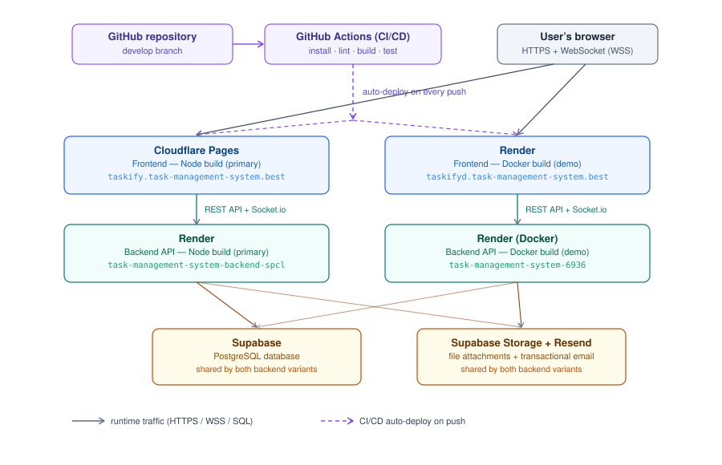

# Task Management System

A full-stack web application that allows users to create, manage, and track tasks collaboratively in real time. Built for the INTE 21323 Group Project.

The system supports:
- User registration, authentication, and role-based access control (Admin, Project Manager, Collaborator)
- Project creation and membership management
- Task creation, assignment, prioritization, and deadline tracking
- Status tracking (To Do → In Progress → Completed)
- Collaboration via comments and file attachments
- Real-time notifications over WebSockets
- Secure API communication (JWT, HTTPS, parameterized queries, input validation)

## Architecture

```
┌─────────────┐        HTTPS / REST        ┌──────────────┐        SQL        ┌──────────────┐
│   Frontend   │ ─────────────────────────▶ │   Backend    │ ─────────────────▶ │  PostgreSQL   │
│  React + Vite │ ◀───────────────────────── │ Express + JWT│ ◀───────────────── │  (Supabase)   │
│  (Cloudflare) │      Socket.io (WS)        │   (Render)   │                    └──────────────┘
└─────────────┘                              └──────┬───────┘
                                                     │
                                                     ▼
                                            Supabase Storage
                                           (task attachments)
```

## Deployment Architecture



## Tech Stack
| Layer | Technology |
|---|---|
| Frontend | React, Vite, Tailwind CSS, Zustand, React Router |
| Backend | Node.js, Express, Socket.io |
| Database | PostgreSQL (hosted on Supabase) |
| File storage | Supabase Storage |
| Auth | JWT, bcrypt |
| Frontend hosting | Cloudflare |
| Backend hosting | Render |
| Containerization | Docker (frontend + backend, deployed as separate demo services on Render) |
| CI | GitHub Actions |

## Project Structure

```
task-management-system/
├── backend/    # Express REST API — see backend/README.md
├── frontend/   # React SPA — see frontend/README.md
├── database/   # SQL schemas and seed data
└── .github/workflows/  # CI pipelines
```

## Live Demo

**Node deployment (primary):**
- **Frontend:** https://taskify.task-management-system.best/login
- **Backend API:** https://task-management-system-backend-spcl.onrender.com
- **API Docs (Swagger):** https://task-management-system-backend-spcl.onrender.com/api-docs

**Docker deployment (containerized demo):**
- **Frontend:** https://taskifyd.task-management-system.best
- **Backend API:** https://task-management-system-6936.onrender.com
- **API Docs (Swagger):** https://task-management-system-6936.onrender.com/api-docs

## Documentation

- [Backend README](./backend/README.md) — setup, environment variables, API docs, Docker, deployment
- [Frontend README](./frontend/README.md) — setup, environment variables, scripts, screenshots

## Database

See `/database/schemas` for the full PostgreSQL schema (roles, users, projects, project_members, tasks, task_assignments, comments, attachments, notifications) and `/database/seeds` for seed data.

## Version Control

- Feature branches per contributor
- Pull requests with merge commits
- Meaningful commit messages

## Team Contributions

| Name | Contribution |
|---|---|
| Harshana | Core setup & DB connection, Authentication (login, JWT, auth middleware, change password, profile), Documentation (Swagger/OpenAPI, README, API usage guide), Deployment (Docker, CI/CD, cloud hosting) — Backend & Frontend |
| Kavinda | Project Management (create/view/update projects, member management), Real-Time Notifications (Socket.io — task/status/comment/deadline/admin notifications, offline storage & reconnection) — Backend & Frontend |
| Baary | Task Management (create/view/update/delete tasks, Kanban board, assignment, filtering & sorting, priority & deadlines, Collaborator task views) — Backend & Frontend |
| Ragu | Comments & Attachments (add/view comments, upload/view attachments) — Backend & Frontend |
| Geethma | Security & Validation (input validation, error handling, SQL injection prevention, CORS, HTTPS, XSS prevention, OWASP compliance, password hashing) — Backend & Frontend |
